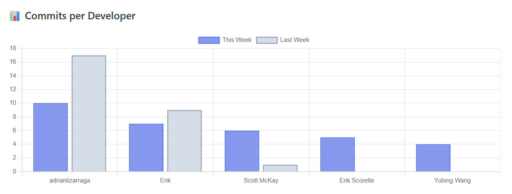
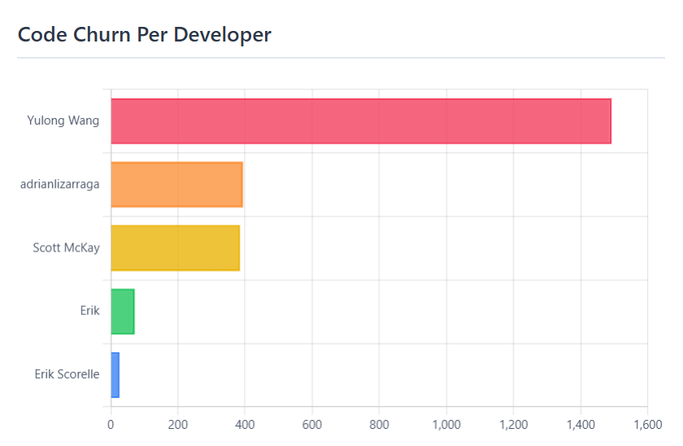
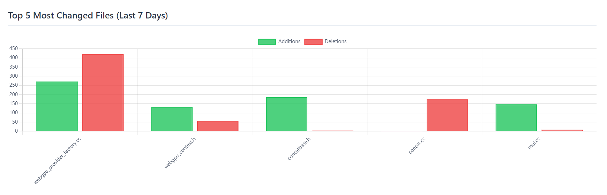

# Development Manager Analytics Tools

A Model Context Protocol (MCP) server providing Git repository analysis tools designed specifically for development managers. Get instant insights into team performance, code health, and project trends through natural language conversations with Claude.

## 🎥 Demo

Watch how simple it is to analyze your repository with natural language:

<video controls width="800">
  <source src="demo.mp4" type="video/mp4">
  Your browser does not support the video tag.
</video>

## Overview

This MCP server enables development managers to analyze Git repositories **without writing any code**. Simply ask Claude questions about your project, and get detailed analytics about commits, developers, code changes, and team performance.

### Perfect For Managers Who Want To:
- Track team productivity and individual contributions
- Identify bottlenecks and inactive developers
- Monitor project health and code quality trends
- Generate weekly/monthly progress reports
- Make data-driven decisions with insights into team performance and workload distribution

## 7 Powerful Analytics Tools

| Tool | What It Does |
|------|---|
| **Project Dashboard** | Comprehensive overview of repository activity and trends |
| **Commit History** | Detailed commit analysis with file changes and statistics |
| **Developer Statistics** | Individual developer performance metrics and contributions |
| **Developer Comparison** | Side-by-side comparison of team members' productivity |
| **File Change Tracking** | Monitor changes to critical files over time |
| **Branch Management** | Track all branches and their activity levels |
| **Repository Sync** | Keep your local repository up to date with fetch/pull |

## Key Capabilities

- ✅ **Time-based filtering** - Analyze any time period (last week, last month, custom ranges)
- ✅ **Developer-specific insights** - Track individual contributions and patterns
- ✅ **Code quality indicators** - Commit sizes, code churn, collaboration patterns
- ✅ **Trend analysis** - Compare activity across different time periods
- ✅ **Natural language interface** - No Git commands needed, just ask Claude
- ✅ **Ready-to-use prompts** - Pre-configured questions for common tasks

## 5 Ready-to-Use Prompts

Skip typing - select a prompt and get instant insights:

| Prompt | Description | What You Get |
|--------|-------------|--------------|
| 📊 **Executive Dashboard** | Visual overview (7 days) | Bar charts with week-over-week comparison, code churn, top files |
| 🔍 **Code Review Priority** | Most changed files | Files needing review, sorted by activity |
| 👤 **Developer Spotlight** | Individual deep dive (30 days) | Personal stats, team comparison, contributions, trends |
| 🌿 **Active Branches** | Ongoing work tracker | Active branches with commit counts and owners |
| ⚡ **Quick Daily Sync** | Today's activity | Fast update with commits, changes, and summary |

## Visual Examples

Example outputs from the Executive Dashboard prompt:

### Commits per Developer (Week-over-Week)


*Track team activity and identify trends*

### Code Churn Analysis


*Measure code volume by developer*

### Top Changed Files


*Identify files requiring review attention*

## Example Questions You Can Ask

### About Team Performance
- "How many commits did we have last week?"
- "Rank developers by commits in the last month"
- "Who hasn't contributed in the last 2 weeks?"

### About Code Health
- "Compare Alice and Bob - who contributed more?"
- "Which files are changing the most frequently?"
- "Who is working on critical files?"

### About Project Activity
- "Show me a dashboard of the entire project"
- "What changed in the last 3 days?"

## Installation & Setup

### Prerequisites
- Python 3.8 or higher
- Git installed and accessible in PATH
- Claude Desktop or compatible MCP client

### Quick Setup (3 steps)

**1. Clone and install**
```bash
git clone <repository-url>
cd gitMCP
pip install -r requirements.txt
```

**2. Configure Claude Desktop**

Add to your Claude Desktop configuration file:

- **Windows:** `%APPDATA%\Claude\claude_desktop_config.json`
- **macOS:** `~/Library/Application Support/Claude/claude_desktop_config.json`

```json
{
  "mcpServers": {
    "git-mcp": {
      "command": "python",
      "args": ["C:\\path\\to\\gitMCP\\server.py"]
    }
  }
}
```

**3. Restart Claude Desktop**

The MCP server will automatically start when you launch Claude Desktop.

## How It Works

gitMCP uses a three-layer architecture:

1. **Git Fetcher** - Runs Git commands with filters (since, until, author, etc.)
2. **Parser** - Transforms raw Git output into structured data
3. **MCP Tool** - Exposes data as Claude-callable functions

Each tool can be used independently or combined for comprehensive analysis.

## Common Workflows

### Weekly Team Report
```
Ask: "Give me a dashboard of the last 7 days"
Get: Activity summary, top contributors, file changes, commit patterns
```

### Identify Bottlenecks
```
Ask: "Which developers are overloaded with work?"
Get: Commit frequency, file ownership, collaboration patterns
```

### Monitor File Changes
```
Ask: "Who modified the authentication module this week?"
Get: Commit history, changes, authors, dates
```

### Track Project Health
```
Ask: "How active is our repository?"
Get: Commit frequency, code churn, active developer count, branch activity

```

## Features

### Natural Language Interface
Just ask questions in plain English. No Git syntax required.

### Comprehensive Analytics
- Commit statistics and trends
- Developer activity patterns
- File change tracking
- Branch management
- Code health metrics

### Real-Time Data
Always working with the latest repository information. Sync with remote anytime.

### Manager-Friendly
- Visual dashboards and reports
- Summary statistics (not overwhelming details)
- Easy-to-understand metrics
- Time-based filtering for any period

## Architecture Highlights

**Async Processing**: All Git operations run asynchronously for performance  
**Error Handling**: Custom exceptions ensure safe, graceful error handling  
**Manager Focus**: Tools return summaries and insights, not raw data  
**Extensible**: Easy to add new analytical tools following established patterns

## Support & Documentation

- **Full documentation:** [README.md](https://github.com/naomiOvad/Git-MCP-Server---Development-Manager-Analytics-Tools#readme) - Installation guide, tool descriptions, and examples
- **Live demo:** [Example conversation](https://claude.ai/share/23354fa9-8473-4cdf-a883-dede8b790d62) - See it in action
- **Source code:** [GitHub](https://github.com/naomiOvad/Git-MCP-Server---Development-Manager-Analytics-Tools) - Contribute or report issues 

---

**Ready to try it?** Install gitMCP today and start asking Claude about your team's productivity!
